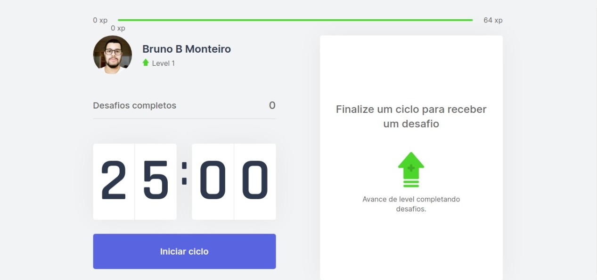

### ✨ Conheça o Moveit 🚀 feito durando a NLW v.4 🚀  

### ☄️ Descrição ☄️

   O Moveit é um Software que te ajuda durante sua jornada com o computador,  
   Com ele você Estuda/Trabalha de forma eficiente, ultilizando a motodogia de pomodoro,  
   Você mantém um foco no aprendizado durante um determinado tempo e após isso recebe desafios,  
   Seus desafios conclídos geram XP que te levam para o próximo Level 🚀  

### 🌌 Tecnologias 🌌

- Typescript
- React
- Next.js

### Para clonar 

-1- vá até o repositório https://github.com/brunoBMonteiro/MoveIt,
-2- Clique em code copiei a url https://github.com/brunoBMonteiro/MoveIt.git,
-3- abra seu terminar e digite git clone + https://github.com/brunoBMonteiro/MoveIt.git,
-4- Acesse a pasta onde você clonou o arquivo e abra no terminal com "code .",

### Iniciar o projeto

-1- Use o comando Yarn dev

   

Feito por [Bruno B Monteiro](https://github.com/BrunoBMonteiro) Durante a NLW v.4 🚀.  
Esse Repósitorio contém uma [MIT Licence]